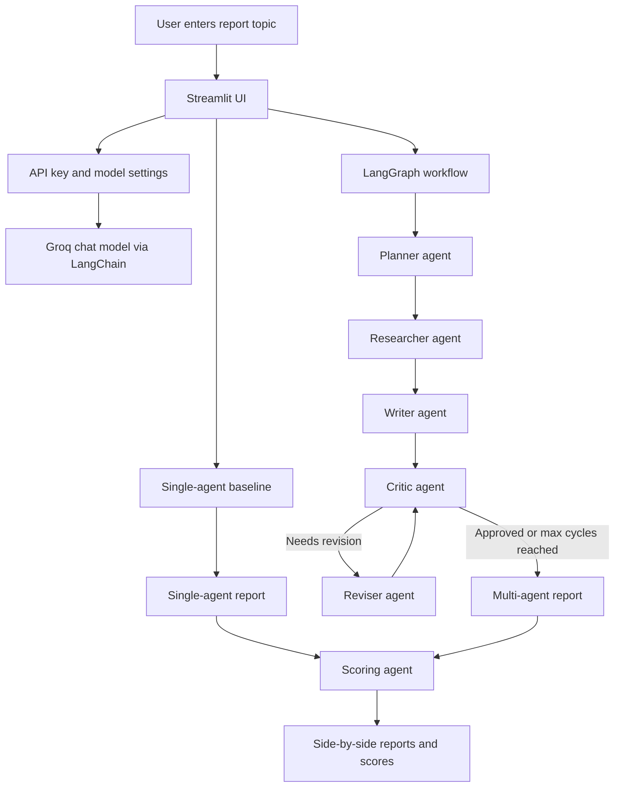

# Multi-Agent Reporter

Multi-Agent Reporter is a Streamlit application that demonstrates how a coordinated LangGraph workflow can produce a more structured technical report than a single prompt-response interaction. The application compares two report generation paths:

- A single-agent baseline that writes a report directly from the user topic.
- A multi-agent workflow that plans, expands, drafts, critiques, revises, and scores the final report.

The project is designed as a clear demonstration of agentic workflow orchestration using LangGraph, LangChain, and Groq-hosted language models.

## Features

- Interactive Streamlit interface for entering a report topic.
- Groq API key support through the sidebar or the `GROQ_API_KEY` environment variable.
- Adjustable model temperature for controlling response creativity.
- Single-agent baseline generation for comparison.
- Multi-step LangGraph workflow with specialized agent roles.
- Revision loop driven by critic feedback.
- Automated scoring of the single-agent and multi-agent outputs.
- Side-by-side report comparison in the browser.

## Application Architecture

The application is organized around a Streamlit UI layer, a LangGraph orchestration layer, and a shared language model interface.



## Agent Responsibilities

| Component | Responsibility |
| --- | --- |
| Planner | Creates a structured outline for the requested technical topic. |
| Researcher | Expands the outline into dense supporting notes and formulas. |
| Writer | Converts the research notes into a polished Markdown report. |
| Critic | Reviews the draft for structure, clarity, formatting, and completeness. |
| Reviser | Applies the critic feedback and produces an improved draft. |
| Scorer | Compares the single-agent and multi-agent reports using a fixed scoring rubric. |

## Execution Flow

1. The user enters a topic in the Streamlit interface.
2. The app initializes a Groq chat model with the selected temperature.
3. The single-agent baseline generates a direct report from the topic.
4. The LangGraph workflow starts with a planner agent that creates a report outline.
5. The researcher agent expands the plan into factual notes and mathematical details.
6. The writer agent creates the initial multi-agent report draft.
7. The critic agent evaluates the draft and either approves it or requests revisions.
8. The reviser agent updates the draft when revisions are required.
9. The critic and reviser loop continues until approval or the maximum revision count is reached.
10. The scoring agent evaluates both outputs and returns numerical scores.
11. Streamlit displays both reports and their scores side by side.

## Tech Stack

| Layer | Technology |
| --- | --- |
| User interface | Streamlit |
| Workflow orchestration | LangGraph |
| Prompt and model integration | LangChain |
| Language model provider | Groq |
| Runtime | Python |

## Project Structure

```text
.
|-- main.py
|-- README.md
`-- requirements.txt
```

### `main.py`

Contains the complete application:

- Streamlit page configuration and UI.
- Groq API key handling.
- LangChain prompt chains.
- LangGraph state definition and workflow construction.
- Agent functions for planning, research, writing, critique, revision, and scoring.
- Final report display and scoring UI.

### `requirements.txt`

Lists the Python dependencies required to run the application.

## Getting Started

### Prerequisites

- Python 3.10 or newer is recommended.
- A Groq API key from `https://console.groq.com`.

### Installation

Clone the repository:

```bash
git clone https://github.com/Abhinaba925/multi-agent-reporter.git
cd multi-agent-reporter
```

Create and activate a virtual environment:

```bash
python3 -m venv .venv
source .venv/bin/activate
```

Install dependencies:

```bash
pip install -r requirements.txt
```

### Configuration

You can provide the Groq API key in either of two ways.

Option 1: Enter the key in the Streamlit sidebar when the app starts.

Option 2: Set the `GROQ_API_KEY` environment variable before launching the app:

```bash
export GROQ_API_KEY="your-groq-api-key"
```

For Windows PowerShell:

```powershell
$env:GROQ_API_KEY="your-groq-api-key"
```

### Run the App

```bash
streamlit run main.py
```

Then open the local Streamlit URL shown in the terminal.

## Example Topics

You can try topics such as:

- Explain transformer attention mechanisms.
- Compare supervised and self-supervised learning.
- Explain quantum entanglement for a technical audience.
- Describe gradient descent and its common variants.
- Explain how retrieval augmented generation works.

## Current Limitations

- The researcher agent does not currently use live web search or external retrieval. It expands the plan using the language model's existing knowledge.
- The scoring agent receives the labels "single-agent" and "multi-agent", so the evaluation is not fully blind.
- Dependency versions are not pinned, which can lead to compatibility changes over time.
- The entire application currently lives in a single Python file, which is convenient for a demo but less ideal as the project grows.

## Suggested Future Improvements

- Add external research tools or retrieval augmented generation.
- Store and display the full critique and revision history.
- Split the application into separate modules for UI, agents, graph construction, and scoring.
- Add structured JSON parsing for the scoring response.
- Pin dependency versions for reproducible installs.
- Add tests for workflow routing, score parsing, and revision loop behavior.

## License

No license file is currently included. Add a license before distributing or reusing the project in production contexts.
