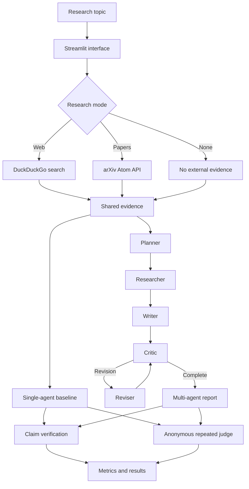

# Multi-Agent Reporter

Multi-Agent Reporter is a Streamlit application for comparing direct LLM generation with a coordinated, evidence-grounded LangGraph workflow. It can search the public web or arXiv, generate reports from shared evidence, verify citations, and evaluate candidates using a repeated order-swapped judging protocol.

## Capabilities

- Selectable Groq-hosted models, including Llama, GPT-OSS, and Qwen options.
- Configurable temperature, output-token budget, source count, and revision cycles.
- Three research modes: no external search, general web search, and arXiv paper search.
- Web-page extraction when retrieved pages permit access.
- Shared evidence context for fair single-agent and multi-agent comparison.
- Inline source identifiers such as `[S1]` and `[P1]`.
- Human-readable `References` sections in both reports.
- LangGraph planner, researcher, writer, critic, and reviser workflow.
- Claim-level checks for missing, invalid, partial, and supported citations.
- Deterministic citation metrics alongside model-based judging.
- Anonymous repeated evaluation with both candidate orders.
- Judge stability and quality-per-1,000-token reporting.

## Architecture



## Workflow

1. The user enters a technical topic and configures the model and research mode.
2. The application retrieves external evidence when web or arXiv mode is selected.
3. The same evidence is supplied to the single-agent baseline and multi-agent workflow.
4. The planner creates an outline and identifies claims requiring support.
5. The researcher synthesizes factual notes and formulas with source IDs.
6. The writer produces Markdown with inline citations and a references section.
7. The critic checks clarity, completeness, formatting, mathematical quality, and evidence use.
8. The reviser updates the report until approval or the revision limit.
9. The verifier computes citation and support metrics.
10. The anonymous judge evaluates both candidates repeatedly with swapped ordering.

## Evaluation rubric

| Criterion | Weight |
| --- | ---: |
| Factuality | 3 |
| Citation correctness | 2 |
| Citation completeness | 2 |
| Task coverage | 1 |
| Clarity | 1 |
| Mathematical correctness | 1 |

The UI reports judge scores, position consistency, citation completeness, claim-support precision, unsupported-claim rate, estimated tokens, and quality per 1,000 tokens. Deterministic evidence metrics should be treated as primary signals; LLM scores require human calibration for publication-grade claims.

## Project structure

```text
.
├── main.py
├── multi_agent_reporter/
│   ├── retrieval.py
│   ├── verification.py
│   ├── evaluation.py
│   ├── workflow.py
│   └── workflow_fixed.py
└── requirements.txt
```

`main.py` is the primary application entry point. The supporting package separates retrieval, verification, evaluation, and workflow logic from the interface.

## Installation

Requirements: Python 3.10+, a Groq API key, and network access for web or arXiv search.

```bash
git clone https://github.com/Abhinaba925/multi-agent-reporter.git
cd multi-agent-reporter
python3 -m venv .venv
source .venv/bin/activate
pip install -r requirements.txt
streamlit run main.py
```

Configure the API key either in the sidebar or with:

```bash
export GROQ_API_KEY="your-groq-api-key"
```

## Example topics

- Derive the Black–Scholes partial differential equation and explain its assumptions.
- Compare retrieval-augmented generation with fine-tuning for factuality.
- Explain transformer attention mechanisms and computational complexity.
- Compare supervised, self-supervised, and reinforcement learning.
- Review recent approaches to multi-agent LLM coordination.

## Limitations

- Live search results change over time; reproducible experiments should use a frozen, timestamped corpus.
- The current claim verifier is lexical and should be complemented by semantic entailment for high-stakes use.
- Search results may contain low-authority sources; inspect the displayed URLs and evidence.
- LLM judges can remain biased after order swapping; human evaluation is required for publication claims.
- Token counts are estimates and do not replace provider billing data.
- This is a research prototype, not an autonomous source for financial, medical, legal, or safety-critical advice.

## License

No license is currently included. Add an appropriate license before distribution or reuse.
